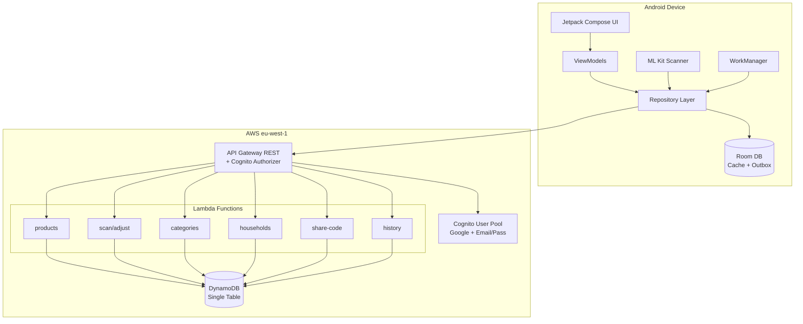
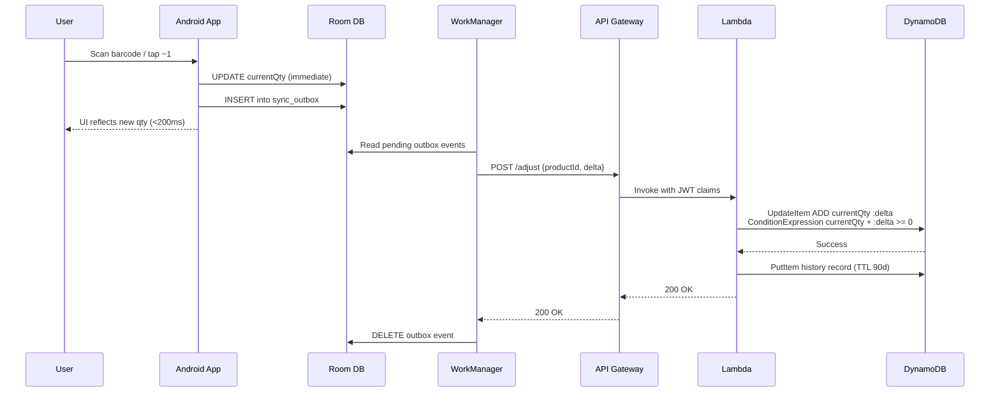
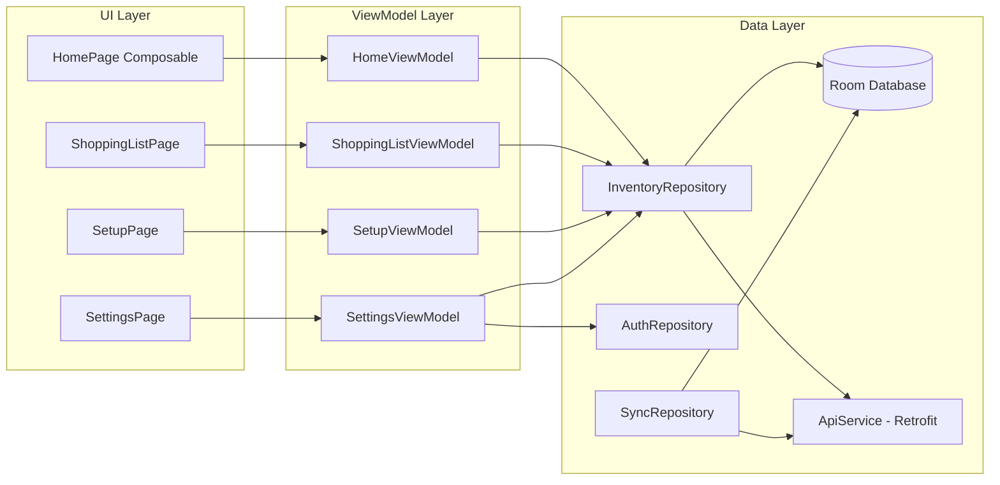
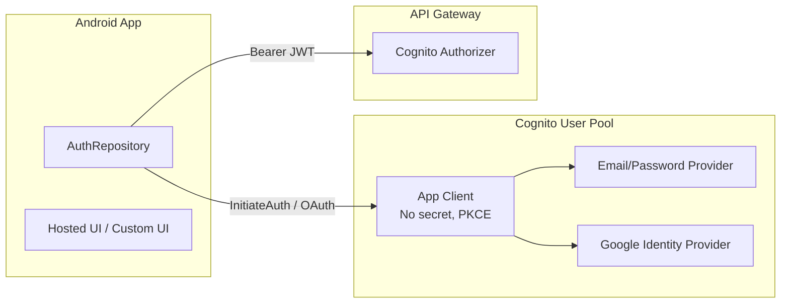
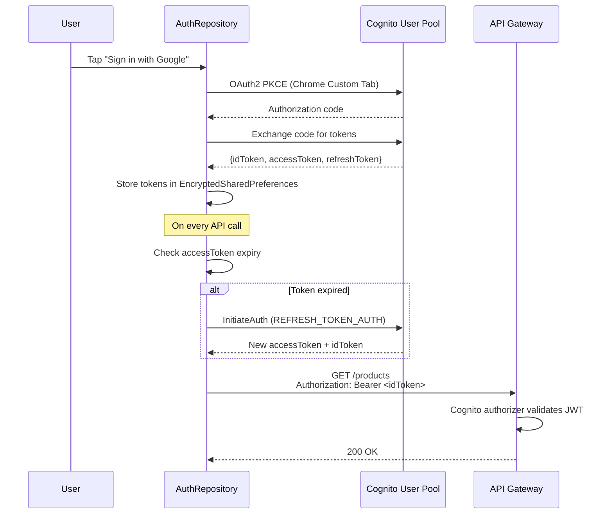
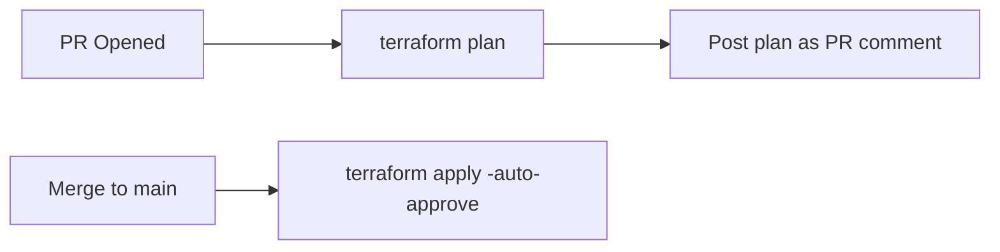
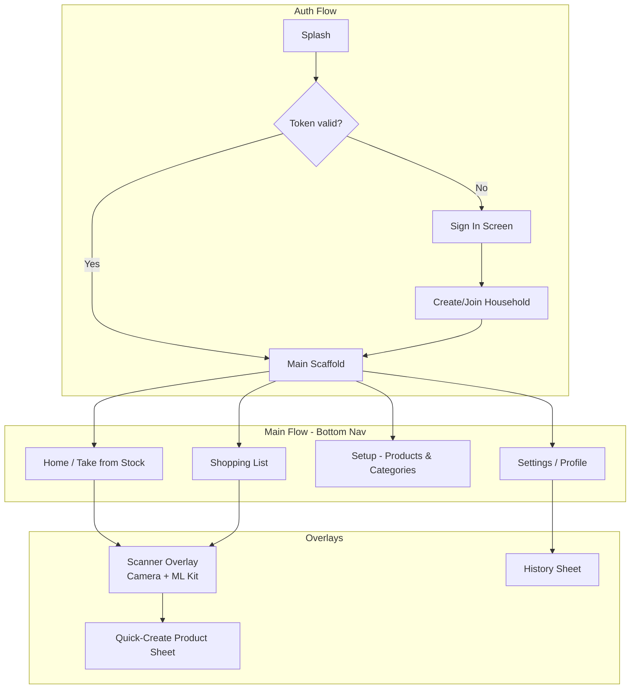

# Design Document: Reabastr Core

## Overview

Reabastr is an inventory-driven household shopping app consisting of a native Android client and a serverless AWS backend. The system tracks stock levels per household; the shopping list is always **derived** from `max(0, idealQty − currentQty)` and never stored as editable state.

The core loop: scan a barcode (or tap +/−) → atomic delta event → local Room cache updates immediately → Sync_Outbox drains to backend when online → DynamoDB applies atomic ADD → history record written.

### Key Design Decisions

| Decision | Rationale |
|----------|-----------|
| Single-table DynamoDB, partitioned by household | All queries are household-scoped; single partition = single query |
| Atomic ADD for all quantity mutations | Eliminates read-modify-write races under concurrency |
| Derived shopping list (never persisted) | Single source of truth; no stale list state |
| Offline-first with outbox pattern | UI is always responsive; sync is eventual |
| Share code with 24h TTL + single-use | Simple invite mechanism, no email infrastructure |
| Cognito with Google + email/password | Standards-based auth with zero custom token logic |

---

## Architecture

### High-Level System Diagram



### Data Flow: Stock Adjustment



---

## Components and Interfaces

### Backend API Contracts

Base URL: `https://{api-id}.execute-api.eu-west-1.amazonaws.com/v1`

All endpoints require `Authorization: Bearer <cognito-jwt>`. The Cognito authorizer validates the token; Lambda handlers extract `sub` and household membership from claims/DynamoDB.

#### Products

| Method | Path | Description |
|--------|------|-------------|
| GET | `/products` | List all products in caller's household |
| POST | `/products` | Create a product |
| PUT | `/products/{productId}` | Update product (name, idealQty, category) |
| DELETE | `/products/{productId}` | Delete product + all EAN mappings |

**POST /products Request:**
```json
{
  "name": "Milk 1L",
  "categoryId": "cat_abc123",
  "idealQty": 3,
  "eans": ["5601234567890"]
}
```

**POST /products Response (201):**
```json
{
  "productId": "prod_xyz789",
  "name": "Milk 1L",
  "categoryId": "cat_abc123",
  "idealQty": 3,
  "currentQty": 0,
  "eans": ["5601234567890"],
  "createdAt": "2025-01-15T10:30:00Z"
}
```

#### Stock Adjustments

| Method | Path | Description |
|--------|------|-------------|
| POST | `/adjust` | Apply a delta event (+N or −N) |

**POST /adjust Request:**
```json
{
  "productId": "prod_xyz789",
  "delta": -1
}
```

**POST /adjust Response (200):**
```json
{
  "productId": "prod_xyz789",
  "currentQty": 2,
  "delta": -1,
  "historyId": "hist_abc"
}
```

**POST /adjust Error (409 — negative stock guard):**
```json
{
  "error": "INSUFFICIENT_STOCK",
  "message": "Current quantity cannot go below zero",
  "currentQty": 0
}
```

#### Categories

| Method | Path | Description |
|--------|------|-------------|
| GET | `/categories` | List categories in sort order |
| POST | `/categories` | Create a category |
| PUT | `/categories/{categoryId}` | Update name or sortOrder |
| DELETE | `/categories/{categoryId}` | Delete (requires product reassignment) |
| PUT | `/categories/reorder` | Batch update sortOrder values |

**PUT /categories/reorder Request:**
```json
{
  "order": [
    {"categoryId": "cat_a", "sortOrder": 1},
    {"categoryId": "cat_b", "sortOrder": 2},
    {"categoryId": "cat_c", "sortOrder": 3}
  ]
}
```

#### EAN Mappings

| Method | Path | Description |
|--------|------|-------------|
| POST | `/products/{productId}/eans` | Add EAN to product |
| DELETE | `/products/{productId}/eans/{ean}` | Remove EAN mapping |
| GET | `/eans/{ean}` | Lookup product by EAN (household-scoped) |

#### Households & Sharing

| Method | Path | Description |
|--------|------|-------------|
| GET | `/household` | Get caller's household info + members |
| POST | `/household/share-code` | Generate share code (24h TTL) |
| POST | `/household/join` | Redeem a share code |
| POST | `/household/leave` | Leave current household |

**POST /household/share-code Response (201):**
```json
{
  "code": "ABCD-1234-EFGH",
  "expiresAt": "2025-01-16T10:30:00Z"
}
```

#### History

| Method | Path | Description |
|--------|------|-------------|
| GET | `/history?limit=50&cursor={cursor}` | Paginated history (reverse chronological) |

**GET /history Response (200):**
```json
{
  "items": [
    {
      "historyId": "hist_abc",
      "productName": "Milk 1L",
      "delta": -1,
      "userName": "João",
      "userId": "cognito-sub-123",
      "timestamp": "2025-01-15T10:30:00Z"
    }
  ],
  "cursor": "eyJTS..."
}
```

#### Sync (Bulk)

| Method | Path | Description |
|--------|------|-------------|
| GET | `/sync` | Full household state for cache reconciliation |
| POST | `/sync/batch` | Upload multiple delta events in one call |

**POST /sync/batch Request:**
```json
{
  "events": [
    {"productId": "prod_a", "delta": -1, "timestamp": "2025-01-15T08:00:00Z"},
    {"productId": "prod_b", "delta": +2, "timestamp": "2025-01-15T08:01:00Z"}
  ]
}
```

---

### Android Components



**Key Android Classes:**

| Class | Responsibility |
|-------|---------------|
| `InventoryRepository` | Mediates Room ↔ API; applies local deltas; manages product/category CRUD |
| `SyncRepository` | Manages outbox drain, reconciliation, WorkManager scheduling |
| `AuthRepository` | Cognito sign-in/sign-up, token refresh, session state |
| `ScannerService` | ML Kit camera lifecycle, EAN decode, callback to ViewModel |
| `OutboxWorker` | WorkManager worker that drains sync outbox on connectivity |
| `ReconcileWorker` | Pulls full state from backend and reconciles Room cache |

---

## Data Models

### DynamoDB Single-Table Design

**Table Name:** `reabastr-main`  
**Partition Key:** `PK` (String)  
**Sort Key:** `SK` (String)  
**GSI1:** `GSI1PK` / `GSI1SK` — for EAN lookups and user→household mapping  
**TTL Attribute:** `ttl` (Number, epoch seconds) — used on History and ShareCode items

#### Access Patterns & Item Types

| Entity | PK | SK | GSI1PK | GSI1SK | Key Attributes |
|--------|----|----|--------|--------|----------------|
| Household | `HH#<hhId>` | `#META` | — | — | `name`, `createdAt` |
| Membership | `HH#<hhId>` | `MBR#<userId>` | `USR#<userId>` | `HH#<hhId>` | `displayName`, `joinedAt` |
| Category | `HH#<hhId>` | `CAT#<catId>` | — | — | `name`, `sortOrder` |
| Product | `HH#<hhId>` | `PROD#<prodId>` | — | — | `name`, `categoryId`, `idealQty`, `currentQty`, `eans[]` |
| EAN Mapping | `HH#<hhId>` | `EAN#<ean>` | `EAN#<ean>` | `HH#<hhId>` | `productId` |
| History | `HH#<hhId>` | `HIST#<timestamp>#<histId>` | — | — | `productName`, `delta`, `userId`, `userName`, `ttl` |
| ShareCode | `HH#<hhId>` | `SHARE#<code>` | `SHARE#<code>` | `HH#<hhId>` | `expiresAt`, `redeemed`, `ttl` |

#### Key Design Rationale

1. **Partition by household**: All product, category, EAN, and history items share `HH#<hhId>` as PK. A single `Query` fetches everything for a household sync.

2. **EAN lookup via GSI1**: When scanning, the app sends the EAN; the backend queries `GSI1PK = EAN#<ean>` to find which household/product owns it. Combined with the authenticated user's household (from Membership GSI1 lookup), we can validate ownership.

3. **History with composite SK**: `HIST#<timestamp>#<histId>` enables reverse-chronological pagination with `ScanIndexForward=False`.

4. **ShareCode lookup via GSI1**: Redemption queries `GSI1PK = SHARE#<code>` to find the target household without knowing it upfront.

5. **Atomic ADD pattern**:
```python
table.update_item(
    Key={"PK": f"HH#{hh_id}", "SK": f"PROD#{prod_id}"},
    UpdateExpression="ADD currentQty :delta",
    ConditionExpression="currentQty + :delta >= :zero OR :delta > :zero",
    ExpressionAttributeValues={":delta": delta, ":zero": 0},
)
```
The condition allows increments unconditionally but blocks decrements that would go negative.

6. **TTL for auto-cleanup**: History items (90 days) and unredeemed share codes (24h) are automatically deleted by DynamoDB TTL.

### Room Database Schema (Android)

```kotlin
@Entity(tableName = "products")
data class ProductEntity(
    @PrimaryKey val productId: String,
    val householdId: String,
    val name: String,
    val categoryId: String?,
    val idealQty: Int,
    val currentQty: Int,
    val eans: List<String>, // stored as JSON string via TypeConverter
    val lastSyncedAt: Long // epoch ms
)

@Entity(tableName = "categories")
data class CategoryEntity(
    @PrimaryKey val categoryId: String,
    val householdId: String,
    val name: String,
    val sortOrder: Int
)

@Entity(tableName = "sync_outbox")
data class OutboxEvent(
    @PrimaryKey(autoGenerate = true) val id: Long = 0,
    val productId: String,
    val delta: Int,
    val timestamp: Long, // epoch ms, creation time
    val retryCount: Int = 0,
    val status: String = "PENDING" // PENDING | FAILED
)
```

### Domain Value Constraints

| Field | Type | Min | Max | Notes |
|-------|------|-----|-----|-------|
| `name` (Product) | String | 1 char | 100 chars | Unique per household (case-insensitive) |
| `name` (Category) | String | 1 char | 50 chars | Unique per household (case-insensitive) |
| `idealQty` | Int | 1 | 9999 | — |
| `currentQty` | Int | 0 | unbounded | May exceed idealQty |
| `delta` | Int | -9999 | +9999 | Non-zero |
| `eans` per Product | List | 0 | 20 | Each EAN: 8 or 13 digit string |
| `sortOrder` | Int | 1 | unbounded | Sequential within household |
| `buyQty` | Derived | 0 | — | `max(0, idealQty - currentQty)` |


---

## Correctness Properties

These properties define formal invariants that the system must uphold. Each is verifiable via property-based testing.

### Property 1: Shopping List Derivation

**Validates: Requirements 3.1, 3.2**

For any Product `p`, `buyQty(p) == max(0, p.idealQty - p.currentQty)`.

- The shopping list is always a pure function of product state; no mutation of the list itself is possible.
- Corollary: if `currentQty >= idealQty`, the product MUST NOT appear on the shopping list.

### Property 2: Atomic Delta Commutativity

**Validates: Requirements 12.1, 12.3**

For any sequence of delta events `[d1, d2, ..., dn]` applied to the same product, the final `currentQty == initial + sum(deltas)`, provided no delta is rejected by the negative-stock guard.

- Order of concurrent deltas does not affect the final value (commutativity of addition).
- Each delta is applied independently via DynamoDB atomic ADD.

### Property 3: Non-Negative Stock Invariant

**Validates: Requirements 1.5, 12.2**

`currentQty >= 0` at all times in the backend (DynamoDB).

- A decrement that would make `currentQty < 0` is rejected; `currentQty` remains unchanged.
- The client mirrors this guard locally (preventing decrement when `currentQty == 0`).

### Property 4: Outbox Eventual Delivery

**Validates: Requirements 8.2, 8.3, 8.4, 8.5**

Every Delta_Event enqueued in the Sync_Outbox is eventually either (a) successfully uploaded and removed, or (b) marked as FAILED after exhausting retries.

- No event is silently dropped.
- Outbox is persisted across restarts (Room persistence guarantee).

### Property 5: Reconciliation Consistency

**Validates: Requirements 8.6**

After a full reconciliation (`GET /sync` → apply to Room), the local Room cache state for all products matches the backend state, adjusted for any pending (unsent) outbox events.

- `localQty == serverQty + sum(pending_deltas_for_product)`

### Property 6: Household Isolation

**Validates: Requirements 9.9, 2.6, 2.7**

No API operation allows a user to read or mutate data belonging to a household they are not a member of.

- Enforced at every endpoint via membership lookup (`GSI1PK = USR#<sub>` → household).

### Property 7: EAN Uniqueness Within Household

**Validates: Requirements 4.7**

Within a single household, each EAN maps to exactly one product. No two products in the same household share an EAN.

### Property 8: Share Code Single-Use

**Validates: Requirements 7.2, 7.3**

A share code transitions through exactly one lifecycle: `ACTIVE → REDEEMED | EXPIRED`. Once redeemed or expired, it cannot grant membership again.

### Property 9: IdealQty Independence

**Validates: Requirements 12.5, 5.3**

Mutating `currentQty` (via delta events) never alters `idealQty`, and mutating `idealQty` (via product update) never alters `currentQty`.

### Property 10: History Completeness

**Validates: Requirements 12.6, 12.7, 10.1**

Every successful `currentQty` mutation in DynamoDB produces exactly one corresponding History record. Rejected mutations produce zero history records.

---

## Error Handling

### Backend Error Strategy

All Lambda handlers return structured JSON error responses. Stack traces are never exposed to the client.

| HTTP Status | Error Code | Condition |
|-------------|-----------|-----------|
| 400 | `VALIDATION_ERROR` | Missing/invalid request body fields |
| 401 | `UNAUTHORIZED` | Missing, malformed, or expired JWT |
| 403 | `FORBIDDEN` | User not a member of the target household |
| 404 | `NOT_FOUND` | Product, category, or household does not exist |
| 409 | `INSUFFICIENT_STOCK` | Decrement would make currentQty negative |
| 409 | `DUPLICATE_NAME` | Product/category name already exists (case-insensitive) |
| 409 | `EAN_IN_USE` | EAN already mapped to another product in household |
| 409 | `SHARE_CODE_EXPIRED` | Share code past TTL |
| 409 | `SHARE_CODE_REDEEMED` | Share code already used |
| 409 | `ALREADY_IN_HOUSEHOLD` | User must leave current household first |
| 422 | `INVALID_CATEGORY` | Referenced category does not exist |
| 429 | `THROTTLED` | DynamoDB provisioned throughput exceeded (retry with backoff) |
| 500 | `INTERNAL_ERROR` | Unexpected Lambda failure |

**Error Response Shape:**
```json
{
  "error": "ERROR_CODE",
  "message": "Human-readable description",
  "details": {}
}
```

### Android Error Handling

| Layer | Strategy |
|-------|----------|
| Network (Retrofit) | Catch `IOException` → treat as offline; enqueue to outbox if applicable |
| HTTP 4xx | Parse error body → surface user-facing message via ViewModel state |
| HTTP 409 (conflict) | Map to domain-specific UI: e.g., "Out of stock", "Name already exists" |
| HTTP 401 | Trigger token refresh; if refresh fails → redirect to sign-in |
| HTTP 429 | Exponential backoff (handled by WorkManager retry policy) |
| HTTP 5xx | Show generic retry message; WorkManager retries for outbox events |
| Room errors | Crash-level: unrecoverable; log to analytics |
| Outbox drain | Up to 3 retries with exponential backoff (1s, 2s, 4s); then mark FAILED |
| Sync capacity | >500 pending events → block new enqueues, show warning |

### Conflict Resolution

The system uses **last-write-wins at the delta level** — there are no merge conflicts because each delta is independently atomic. The only "conflict" is the negative-stock guard rejection, which is handled by:
1. Backend rejects the operation (409)
2. App marks the outbox event as FAILED
3. App triggers reconciliation to realign local state with server
4. User is notified of the failed action

---

## Testing Strategy

### Backend Testing (Python)

**Framework:** pytest + moto (DynamoDB mock) + hypothesis (property-based testing)

#### Unit Tests
- Each Lambda handler tested in isolation with mocked DynamoDB (moto).
- Validate input parsing, error responses, and DynamoDB expressions.

#### Property-Based Tests (hypothesis)

| Property | Generator | Assertion |
|----------|-----------|-----------|
| P2: Delta commutativity | Random permutations of delta sequences | Final qty equals initial + sum regardless of order |
| P3: Non-negative guard | Random negative deltas against low currentQty | currentQty never goes below 0; rejection returns 409 |
| P6: Household isolation | Random user/household pairs | Cross-household access always returns 403 |
| P7: EAN uniqueness | Random EAN assignments | Duplicate EAN within household always returns 409 |
| P8: Share code lifecycle | Random redeem/expire sequences | Code is usable exactly once |
| P10: History completeness | Random delta batches | Successful deltas produce exactly 1 history record each |

#### Integration Tests
- Deploy to a dev DynamoDB table (not mocked).
- Confirm atomic-delta behavior: two concurrent `−1`/`+1` calls net correctly.
- Confirm negative-stock guard rejects over-decrement.
- Test share-code redemption: valid, expired, already-used.
- Validate Cognito authorizer rejects unsigned/expired tokens.

### Android Testing (Kotlin)

**Frameworks:** JUnit 5 + Turbine (Flow testing) + Robolectric + kotest-property (PBT)

#### Unit Tests
- ViewModels: verify state emissions for each user action.
- Repository: mock Room + API; verify local-first application of deltas.
- BuyQty derivation: verify `max(0, idealQty - currentQty)` for edge cases.

#### Property-Based Tests (kotest-property)

| Property | Generator | Assertion |
|----------|-----------|-----------|
| P1: Shopping list derivation | Random (idealQty, currentQty) pairs | buyQty == max(0, ideal - current) |
| P4: Outbox delivery | Random event sequences + simulated failures | All events reach terminal state |
| P5: Reconciliation | Random server state + pending outbox | Post-reconcile local == server + pending |
| P9: IdealQty independence | Random interleaved updates to ideal and current | Neither field affects the other |

#### UI Tests
- Compose testing: verify each page renders primary action correctly.
- Offline path: simulate airplane mode, make adjustments, confirm Room updates and outbox queues.
- Locale rendering: all 4 locales render without overflow on 320dp width.

### CI Integration

```yaml
# Backend tests run on every push to /lambda/**
- pytest with moto (unit + PBT)
- Integration tests against dev DynamoDB table (on PR to main)

# Android tests run on every push to /android/**
- Unit + PBT via ./gradlew testDebugUnitTest
- Instrumented tests via ./gradlew connectedDebugAndroidTest (on PR to main)
```


---

## Authentication & Authorization

### Cognito User Pool Configuration



**User Pool Settings:**

| Setting | Value |
|---------|-------|
| Region | eu-west-1 |
| Sign-in attributes | email |
| MFA | Optional (TOTP only, not SMS) |
| Email verification | Required (Cognito-native email, no SES) |
| Password policy | Min 8 chars, requires uppercase + lowercase + number |
| Token validity | Access: 1h, ID: 1h, Refresh: 30 days |
| App client | Public (no secret), PKCE authorization code flow |
| Hosted UI domain | `reabastr.auth.eu-west-1.amazoncognito.com` |

**Google Federation:**
- Identity provider type: OIDC (Google)
- Scopes: `openid`, `email`, `profile`
- Attribute mapping: `email` → Cognito `email`, `name` → Cognito `name`, `sub` → Cognito `username` (prefixed with `Google_`)
- Auto-link accounts by email: enabled (users who sign up with email and later use Google with the same email share the same Cognito identity)

### JWT Flow on Android



**Token Storage:**
- Tokens stored in Android `EncryptedSharedPreferences` (AES-256)
- Access/ID tokens refreshed proactively 5 minutes before expiry
- Refresh token failure → clear all tokens → redirect to sign-in

### API Gateway Cognito Authorizer

- Type: `COGNITO_USER_POOLS`
- Token source: `Authorization` header
- Validates: signature, expiry, issuer, audience (app client ID)
- Passes `claims` to Lambda via `event.requestContext.authorizer.claims`
- Key claims used by handlers: `sub` (user ID), `email`, `cognito:username`

### Household Membership Validation (Lambda)

Every household-scoped handler follows this pattern:

```python
def resolve_household(user_sub: str) -> str:
    """Look up the caller's household via GSI1."""
    resp = table.query(
        IndexName="GSI1",
        KeyConditionExpression="GSI1PK = :pk",
        ExpressionAttributeValues={":pk": f"USR#{user_sub}"},
    )
    items = resp.get("Items", [])
    if not items:
        raise ForbiddenError("User is not a member of any household")
    return items[0]["GSI1SK"].removeprefix("HH#")
```

This runs before any data access. If the resolved household doesn't match the target resource's household, the handler returns 403.

### First-Time User Flow

1. User signs in (Google or email/password) → Cognito creates user
2. App calls `GET /household` → Backend finds no Membership for this `sub` → returns 404
3. App presents choice: "Create a household" or "Join with a code"
   - Create: `POST /household` → creates Household + Membership items
   - Join: `POST /household/join` with share code → creates Membership item

---

## Internationalization Architecture

### String Resource Structure

```
android/app/src/main/res/
├── values/              # English (default)
│   └── strings.xml
├── values-pt/           # Portuguese
│   └── strings.xml
├── values-es/           # Spanish
│   └── strings.xml
└── values-fr/           # French
    └── strings.xml
```

All user-facing text lives in `strings.xml`. No hardcoded strings in composables.

### Locale Override Mechanism

```kotlin
// LocaleManager stored in DataStore (not SharedPreferences)
class LocaleManager(private val dataStore: DataStore<Preferences>) {

    val currentLocale: Flow<Locale?> = dataStore.data.map { prefs ->
        prefs[LOCALE_KEY]?.let { Locale.forLanguageTag(it) }
    }

    suspend fun setLocale(locale: Locale?) {
        dataStore.edit { prefs ->
            if (locale == null) prefs.remove(LOCALE_KEY)
            else prefs[LOCALE_KEY] = locale.toLanguageTag()
        }
    }
}
```

**Runtime Application:**
- The app wraps its `Activity` context with `AppCompatDelegate.setApplicationLocales()` (per-app language API, Android 13+)
- For pre-Android 13: uses `context.createConfigurationContext()` with the override locale
- Change takes effect within 1 second, no restart needed
- Compose UI recomposes automatically because the context configuration change triggers recomposition

### Fallback Logic

1. If user selected override → use override locale
2. If no override → check device system locale
3. If system locale matches `{en, pt, es, fr}` → use it
4. Otherwise → fall back to English

### Layout Considerations

- All text containers use `maxLines` + `overflow = TextOverflow.Ellipsis` as safety
- Tested at 320dp minimum width (smallest supported viewport)
- Button text uses `AutoSizeText` pattern for labels that expand in pt/es/fr
- RTL: not required (none of the 4 locales are RTL)

---

## Infrastructure Design (Terraform)

### Module Structure

```
terraform/
├── bootstrap/                  # Applied manually, once
│   ├── main.tf                 # S3 state bucket, DynamoDB lock table
│   ├── oidc.tf                 # GitHub OIDC provider + deploy role
│   ├── variables.tf
│   └── outputs.tf
└── main/                       # Applied by CI/CD pipeline
    ├── backend.tf              # S3 remote state config
    ├── provider.tf             # AWS provider, eu-west-1
    ├── variables.tf
    ├── outputs.tf
    ├── cognito.tf              # User Pool, App Client, Google IdP
    ├── dynamodb.tf             # Single table + GSI1
    ├── api_gateway.tf          # REST API, stages, authorizer
    ├── lambda.tf               # Function definitions + IAM
    ├── lambda_iam.tf           # Execution roles + policies
    └── lambda/                 # Source bundles (zipped by CI)
        ├── products/
        ├── adjust/
        ├── categories/
        ├── households/
        ├── share_code/
        ├── history/
        └── sync/
```

### Key Resource Definitions

**bootstrap/oidc.tf** (applied once manually):
```hcl
resource "aws_iam_openid_connect_provider" "github" {
  url             = "https://token.actions.githubusercontent.com"
  client_id_list  = ["sts.amazonaws.com"]
  thumbprint_list = ["6938fd4d98bab03faadb97b34396831e3780aea1"]
}

resource "aws_iam_role" "github_deploy" {
  name = "reabastr-github-deploy"
  assume_role_policy = jsonencode({
    Version = "2012-10-17"
    Statement = [{
      Effect = "Allow"
      Principal = { Federated = aws_iam_openid_connect_provider.github.arn }
      Action = "sts:AssumeRoleWithWebIdentity"
      Condition = {
        StringEquals = { "token.actions.githubusercontent.com:aud" = "sts.amazonaws.com" }
        StringLike   = { "token.actions.githubusercontent.com:sub" = "repo:<org>/<repo>:*" }
      }
    }]
  })
}
```

**main/dynamodb.tf**:
```hcl
resource "aws_dynamodb_table" "main" {
  name         = "reabastr-main"
  billing_mode = "PAY_PER_REQUEST"
  hash_key     = "PK"
  range_key    = "SK"

  attribute {
    name = "PK"
    type = "S"
  }
  attribute {
    name = "SK"
    type = "S"
  }
  attribute {
    name = "GSI1PK"
    type = "S"
  }
  attribute {
    name = "GSI1SK"
    type = "S"
  }

  global_secondary_index {
    name            = "GSI1"
    hash_key        = "GSI1PK"
    range_key       = "GSI1SK"
    projection_type = "ALL"
  }

  ttl {
    attribute_name = "ttl"
    enabled        = true
  }

  point_in_time_recovery { enabled = true }
}
```

**main/cognito.tf**:
```hcl
resource "aws_cognito_user_pool" "main" {
  name = "reabastr-pool"

  auto_verified_attributes = ["email"]
  username_attributes      = ["email"]

  password_policy {
    minimum_length    = 8
    require_lowercase = true
    require_uppercase = true
    require_numbers   = true
    require_symbols   = false
  }

  email_configuration {
    email_sending_account = "COGNITO_DEFAULT"
  }

  schema {
    name                = "email"
    attribute_data_type = "String"
    required            = true
    mutable             = true
  }
}

resource "aws_cognito_user_pool_client" "app" {
  name         = "reabastr-android"
  user_pool_id = aws_cognito_user_pool.main.id

  explicit_auth_flows = [
    "ALLOW_REFRESH_TOKEN_AUTH",
    "ALLOW_USER_SRP_AUTH",
  ]

  supported_identity_providers = ["COGNITO", "Google"]
  callback_urls               = ["reabastr://callback"]
  logout_urls                 = ["reabastr://signout"]
  allowed_oauth_flows         = ["code"]
  allowed_oauth_scopes        = ["openid", "email", "profile"]
  generate_secret             = false

  access_token_validity  = 1   # hours
  id_token_validity      = 1   # hours
  refresh_token_validity = 30  # days
}

resource "aws_cognito_identity_provider" "google" {
  user_pool_id  = aws_cognito_user_pool.main.id
  provider_name = "Google"
  provider_type = "Google"

  provider_details = {
    client_id        = var.google_client_id
    client_secret    = var.google_client_secret
    authorize_scopes = "openid email profile"
  }

  attribute_mapping = {
    email    = "email"
    username = "sub"
    name     = "name"
  }
}
```

**main/api_gateway.tf** (authorizer excerpt):
```hcl
resource "aws_api_gateway_authorizer" "cognito" {
  name            = "cognito-authorizer"
  rest_api_id     = aws_api_gateway_rest_api.main.id
  type            = "COGNITO_USER_POOLS"
  provider_arns   = [aws_cognito_user_pool.main.arn]
  identity_source = "method.request.header.Authorization"
}
```

### State Management

- Backend: S3 bucket with native state locking (no DynamoDB lock table needed with newer Terraform)
- State file: `s3://reabastr-tf-state/main/terraform.tfstate`
- Bootstrap state: stored locally (committed to repo as it's non-sensitive infra metadata)

---

## CI/CD Pipeline Design

### Workflow Structure

```
.github/workflows/
├── terraform.yml       # Triggered by terraform/** changes
├── lambda.yml          # Triggered by lambda/** changes
└── android.yml         # Triggered by android/** changes
```

### Path Filtering

```yaml
# terraform.yml
on:
  pull_request:
    paths: ["terraform/main/**"]
  push:
    branches: [main]
    paths: ["terraform/main/**"]
```

```yaml
# lambda.yml
on:
  pull_request:
    paths: ["lambda/**"]
  push:
    branches: [main]
    paths: ["lambda/**"]
```

```yaml
# android.yml
on:
  pull_request:
    paths: ["android/**"]
  push:
    branches: [main]
    paths: ["android/**"]
```

### Terraform Pipeline



**OIDC Authentication:**
```yaml
permissions:
  id-token: write
  contents: read

jobs:
  deploy:
    runs-on: ubuntu-latest
    steps:
      - uses: aws-actions/configure-aws-credentials@v4
        with:
          role-to-assume: arn:aws:iam::<account>:role/reabastr-github-deploy
          aws-region: eu-west-1
```

### Lambda Pipeline

1. **On PR**: Run `pytest` (unit + PBT with moto) → report results
2. **On merge to main**: Zip each handler → upload to S3 → `terraform apply` updates Lambda function code via `s3_key` change

### Android Pipeline

1. **On PR**: `./gradlew testDebugUnitTest` (unit + PBT) → lint → report
2. **On merge to main**: `./gradlew assembleRelease` → sign APK → upload to artifact store (Play Store upload is manual for v1)

---

## Android Navigation & UI Architecture

### Navigation Graph



### Compose Navigation Setup

```kotlin
@Composable
fun ReabastrNavHost(navController: NavHostController) {
    NavHost(navController, startDestination = "splash") {
        composable("splash") { SplashScreen(navController) }
        composable("sign_in") { SignInScreen(navController) }
        composable("onboard") { OnboardScreen(navController) }

        // Main scaffold with bottom nav
        composable("main") {
            MainScaffold(navController)
        }
    }
}

@Composable
fun MainScaffold(rootNavController: NavHostController) {
    val bottomNavController = rememberNavController()
    Scaffold(
        bottomBar = { ReabastrBottomBar(bottomNavController) }
    ) { padding ->
        NavHost(bottomNavController, startDestination = "home") {
            composable("home") { HomePage() }
            composable("shopping") { ShoppingListPage() }
            composable("setup") { SetupPage() }
            composable("settings") { SettingsPage() }
        }
    }
}
```

### Material 3 Theming

```kotlin
@Composable
fun ReabastrTheme(
    darkTheme: Boolean = isSystemInDarkTheme(),
    content: @Composable () -> Unit
) {
    val colorScheme = when {
        // Dynamic color on Android 12+
        Build.VERSION.SDK_INT >= 31 && darkTheme -> dynamicDarkColorScheme(LocalContext.current)
        Build.VERSION.SDK_INT >= 31 -> dynamicLightColorScheme(LocalContext.current)
        darkTheme -> DarkColorScheme
        else -> LightColorScheme
    }

    MaterialTheme(
        colorScheme = colorScheme,
        typography = ReabastrTypography,
        content = content
    )
}
```

- **Dark/Light**: Follows system setting; no manual toggle in v1
- **Dynamic color**: Uses Material You on Android 12+; falls back to brand palette on older devices
- **Brand palette**: Warm green (primary) + neutral surface tones

### State Management Pattern

```kotlin
// Unidirectional data flow: State down, Events up
class HomeViewModel(
    private val inventoryRepo: InventoryRepository,
    private val syncRepo: SyncRepository,
) : ViewModel() {

    private val _uiState = MutableStateFlow(HomeUiState())
    val uiState: StateFlow<HomeUiState> = _uiState.asStateFlow()

    fun onEvent(event: HomeEvent) {
        when (event) {
            is HomeEvent.DecrementProduct -> decrementProduct(event.productId)
            is HomeEvent.ScanResult -> handleScan(event.ean)
            // ...
        }
    }

    private fun decrementProduct(productId: String) {
        viewModelScope.launch {
            inventoryRepo.decrementLocal(productId) // Room update
            syncRepo.enqueueDelta(productId, delta = -1) // Outbox
        }
    }
}

data class HomeUiState(
    val products: List<ProductUi> = emptyList(),
    val isLoading: Boolean = false,
    val error: String? = null,
)

sealed interface HomeEvent {
    data class DecrementProduct(val productId: String) : HomeEvent
    data class ScanResult(val ean: String) : HomeEvent
}
```

Each page follows the same pattern:
- `ViewModel` exposes `StateFlow<UiState>`
- Composable collects state via `collectAsStateWithLifecycle()`
- User actions dispatched as sealed `Event` objects
- ViewModel delegates to Repository layer
- Repository handles Room (local) + API (remote) coordination
